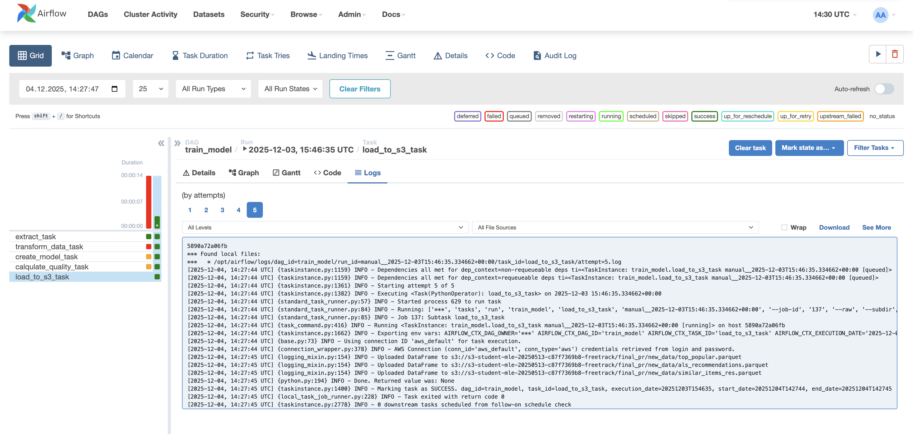
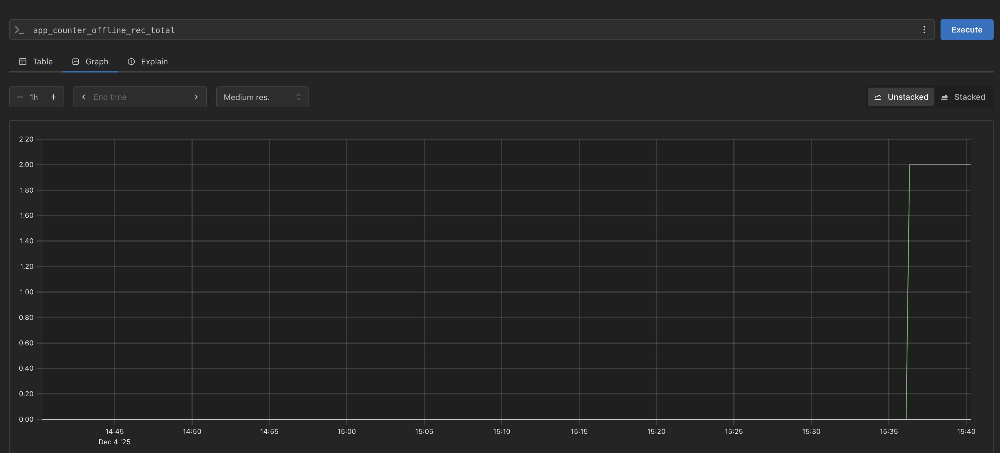
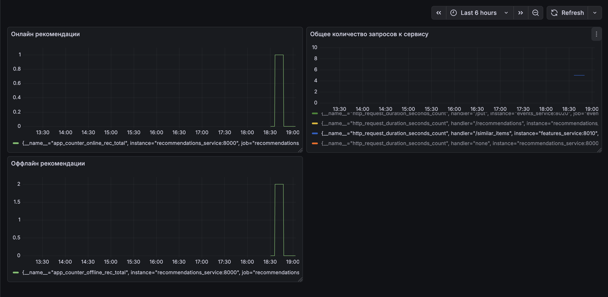

# Финальный проект 
*Kейс 2: Рекомендации товаров в электронной коммерции*
### Цель: 
Предсказать, какие товары предложить пользователю интернет-магазина.
### Основные задачи: 
Анализ событий и характеристик товаров, выбор метрик, построение модели рекомендаций, внедрение модели в виде веб-сервиса, мониторинг и обновление модели.

В рамках нашего проекта вы будете ориентироваться на добавления товаров в корзину. Это не значит, что из выборки нужно выкидывать другие позитивные действия (транзакции), — просто некоторые действия (покупки) хорошо подсвечивают, что нравится пользователю, либо предоставляют механизм фильтрации (человек купил холодильник, рекомендовать ему этот товар больше не имеет смысла).
## Пометка
В ходе реализации данного проекта много времени было убито на исследование данных, поэтому было решено реализовывать MVP, чтобы уложиться в срок сдачи финального проекта.

## 1. Исследование данных. Проведите первичный анализ данных в Jupyter Notebook и опишите увиденные в них закономерности.
### Артефакты:
Для загрузки данных написан файл `mle-pr-final/load_data.py`: загрузка в папку `mle-pr-final/datasets`
Jupyter Notebook с EDA - `EDA.ipynb`

### Выводы по результатам этапа: 
1. В датасете есть пропущенные значения: думаю это связано с тем, что все товары разделены на 25 основных групп. Например: "Одежда", "Для животных", "Красота и здоровье" и тд
2. Родительских категорий в 4,5 раз меньше, чем дочерних

1. transactionid - много пропущенных значений (не все записи связаны с транзакциями, это норма)
2. Duplicated rows: 540679 по колонкам ['visitorid', 'itemid', 'event'] => пользователи могут несколько раз совершать целевое действие с товарим
4. В колонках timestamp	visitorid	event	itemid пропусков не обнаружено
5. Большая часть пользователей просмотрели/положили в корзину только 1 товар (более 70 процентов из тех кто положил товар в карзину сдалал это только 1 раз)
6. Около 30 % товаров было просмотрено только 1 человеком
7. Большинство пользователей просмотрели до 5 товаров

1. timestamp — временная метка добавления свойства. 
2. Свойства товаров могут изменяться со временем
3. Среди свойств есть два типа свойств, которые выбиваются из общей массы: 'available', 'categoryid'. Скорее всего available - отвечает за доступность товара, categoryid - за категорию товара. 
4. value - не всегда представляет из себя только 1 число, иногда value - это список чисел, которые перечислены через пробел 
5. itemid полностью пересекаются в df_item_properties_part1 и df_item_properties_part2
6. Судя по данным можно задать товару разные параметры, но не активировать его
7. Убрала из датасета данные о товарах, которые не были активированы

Преобразование данных: 
1. Были исключены товары, которые никогда не были доступны
2. При таргетной выдачи исключать недоступные товары
3. Преобразованы данные: 
    - созданы отдельные клонки с 'available', 'categoryid'
4. Данных внутри property слишком много - 1000 числовых значений, пока не понятно как они пригодятся при дальнейшем анализе. Предполагаю, что это кодирование категориальных переменных и брать от них какие-то математические функции не выжу смысла. 
5. Были оставлены топ 10 проперти (числовых) для каждой категории

## 2. Подготовка инфраструктуры. Разверните MLflow с хранилищем артефактов.

### Выводы по результатам этапа: 
Создан файл `mle-pr-final/ml-flow/run_mlflow_server.sh`
Запуск: `sh ml-flow/run_mlflow_server.sh`

## 3. Трансляция. Выберите метрики, которые вы хотите оптимизировать, и решите, как будете решать задачу.

### 1️⃣ Определение целей и метрик

Цель: Создание рекомендательной системы основной целевой сигнал которой - добавление товаров в корзину. Также учитывать другие сигналы.

Метрики для оценки системы:

- Precision@K — доля предложенных товаров в топ-K, которые пользователь реально добавил в корзину.
- Recall@K — доля всех товаров, которые пользователь добавил в корзину, и которые оказались в топ-K рекомендаций.

### 2️⃣ Какие данные можно использовать
 Взаимодействиям 'view' 'addtocart' 'transaction' расставить веса: 'view' = 1, 'addtocart' = 5, 'transaction' = 3. Оценка взаимодействия с товаром будет строиться на сумме весов взаимодействий. Если пользователь несколько раз посмотрел товар, то это тоже будет учитываться

### 3️⃣ Выбор подхода

Коллаборативная фильтрация (ALS)

Фичи:

Сколько раз пользователь смотрел товар / категорию.

При реализации сервиса: 
Совпадение с последними действиями.

## 4. Моделирование. Проведите эксперименты. Подготовьте пайплайн обработки данных и построения модели.

#### Top Popular
У данной модели высокая новизна (приблизительно 1), так как большинство популярных треков не совпадают с индивидуальными предпочтениями пользователей.

Однако precision и recall очень низкие — популярные треки плохо отражают реальные интересы пользователей.

Coverage тоже низкий (0.000272), т.к. модель  использует только небольшой набор популярных треков.

#### Personal ALS

ALS показывает значительно выше coverage (≈0.05). Она рекомендует гораздо больше уникальных треков, то есть рекомендации более персонали зированные.

Precision и recall всё ещё низкие, но немного лучше, чем топ популярных. Это указывает на то, что модель частично улавливает вкусы пользователей.

## 5. Продуктивизация. Оберните модель в веб-сервис, чтобы она отвечала на запросы по API. Также сервис должен подниматься в Docker для удобства выкатки.
папка с сервисом: `mle-pr-final/services`

перейти в папку с докером и поднять его: 
```
cd mle-pr-final/services
docker-compose up --build
```

Логи тестирование сервиса лежат в `/mle-pr-final/services/test_service.log`

Было реализовано 3 микросервиса, которые взаимодействуют между собой: 
mle-pr-final/services/ml_service/recommendations_service.py - отдает рекомендации
mle-pr-final/services/ml_service/features_service.py - отдает списки похожих объектов
mle-pr-final/services/ml_service/events_service.py - сохраняет последнюю активность пользователя

recommendations_service - http://localhost:8000
features_service - http://localhost:8010
events_service - http://localhost:8020

Тут можно улучшить передавая тип взаимодействия, если взаимодействие - покупка, то больше не рекомендовать похожие товары (но из-за сжатых сроков не успела реализовать)

## 6. Создание пайплайна дообучения модели. Чтобы модель обновлялась, заберите исторические данные и обучите модель по расписанию.
В Airflow даг забирает данные из БД (данные были предварительно загружены), предобрабатывает (приводит необходимые колонки к необходимым типам, создает необходимые данные для обучения) Дообучает ALS модель и подсчитывает получившиеся метрики, затем сохраняет результаты разобы в S3 (папка: final_pr/new_data/)

Перейти в необходимую дирректорию: `cd mle-pr-final/airflow/`
Запуск: `docker compose up --build`

Название ДАГа: train_model
Логин: airflow
Пароль: airflow

Результат работы: 



## 7. Мониторинг. Проследите, чтобы все сервисы в продакшен-среде контролировались метриками.
Был подключен сервис prometheus

Были созданы метрики: 
app_counter_online_rec - количество раз, когда были отданы перемешанные онлайн и офлайн рекомендации
app_counter_offline_rec - количество раз, когда были отданы только офлайн рекомендации
app_counter_empty_result - количество раз, когда не удалось отдать список похожих товаров

#### prometheus


#### grafana
Dashboards.json



## 8. Документация. 
Я очень надеюсь, что описала все необходимое выше :)

## 9. Требования и среда. Зафиксируйте случайные состояния и приложите зависимости, с которыми вы работали в рамках прокта. Важно соблюсти воспроизводимость экспериментов.


